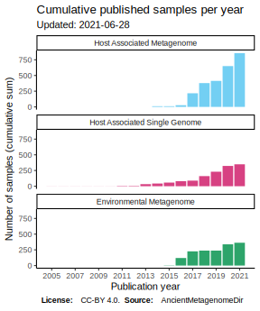
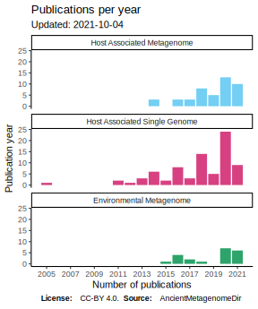
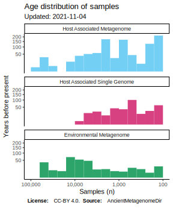

----

AncientMetagenomeDir is a community curated resource of lists of all published
**shotgun**-sequenced ancient metagenome or microbial genome-level enriched samples. It is primarily meant to act
as a reference guide to help point researchers toward any relevent public data
for comparative analysis. It is hoped it will help researchers track growth and
development of the field of ancient metagenomics over time.

<!-- TOC -->

- [Description](#description)
- [Usage](#usage)
- [Citation](#citation)
- [Current Status](#current-status)
  - [Interactive map](#interactive-map)
- [Contributing](#contributing)
  - [Own Publications](#own-publications)
  - [Previous Publications](#previous-publications)
  - [Guidelines and Conventions](#guidelines-and-conventions)

<!-- /TOC -->

## Description

These lists contain information such as publication, sample name, sample type,
geographic location, dates and DOIs and other accession numbers to raw data
in establised sequencing data databases. We define here 'metagenome' in a broad
sense, primarily focusing any data where the whole DNA content is analysed and
explored. Examples for this are (but not limited to) ancient microbiomes (host associated metagenome),
ancient sedimentary DNA (environmental) and also samples used for ancient pathogen
screening (single genomes). See the README of each list for more detailed
descriptions of the contents of each list. Further modification and expansion of
these categories can be proposed to the [SPAAM community](https://spaam-community.github.io)
for further consideration.

The purpose of this repository is not meant to be a comprehensive set of all
metadata about every ancient metagenome, but the aim is to have a lightweight
set of minimal information but with sufficient links to original sources of
detailed information. Keeping the repository simple and lightweight will promote
continual updating of the lists over a long period of time. That said, we will
design lists as far as possible to follow larger database metadata
specifications e.g.
[MIxS](https://www.ebi.ac.uk/ena/submit/mixs-checklists#MIxS_shared) for
compatibility.

Finally, we aim to make releases of this at regular intervals, and assign each
release a citeable DOI. Each release will also include a changelog to record all
additions and any corrections or modifications. Therefore researchers are free
to use the information in their own publications, as per the CC-BY 4.0 licence.

## Usage

To download the latest _stable_ release of an AncientMetagenomeDir sample list:

1. Go to the AncientMetagenomeDir [Zenodo repository](https://doi.org/10.5281/zenodo.3980833)
2. Scroll down the page to the 'Files' section
3. Press the 'Download' button next to the `.zip` button
4. Once downloaded, unzip the archive by right-clicking and pressing e.g. decompress or extract
5. In the extracted folder, change into the sample list of interest, and open the `.tsv` file in a spreadsheet program (e.g. LibreOffice Calc, Microsoft Excel) or your programming language of choice (e.g. R)

To download the _bleeding edge_ AncientMetagenomeDir sample list:

1. Right click on one of the following URLs:
    - Ancient single genome - host associated: [samples](https://raw.githubusercontent.com/SPAAM-community/AncientMetagenomeDir/master/ancientsinglegenome-hostassociated/ancientsinglegenome-hostassociated.tsv)
    - Ancient metagenome - host associated: [samples](https://raw.githubusercontent.com/SPAAM-community/AncientMetagenomeDir/master/ancientmetagenome-hostassociated/ancientmetagenome-hostassociated.tsv)
    - Ancient metagenome - environmental [Samples](https://raw.githubusercontent.com/SPAAM-community/AncientMetagenomeDir/master/ancientmetagenome-environmental/ancientmetagenome-environmental.tsv)
2. Press 'Save Link as' and save. The file name should end in `.tsv`.
3. Open the resulting `.tsv` file in a spreadsheet program (e.g. LibreOffice Calc, Microsoft Excel) or your programming language of choice (e.g. R). 

:warning: the TSV files in the repository represent the cutting-edge version, and are subject to change, please use the files in the 'releases' section for when using for reproducible science!

:heavy_check_mark: For some spreadsheet software copy>paste of the raw format directly into a spreadsheet of the _contents_ of the links above can work, if not, follow instructions above.

## Citation

:book: For **general** of the project, please use the paper citation below.

For a specific _release_ citation (e.g. the version used for analysis), go to [Releases](https://github.com/SPAAM-community/AncientMetagenomeDir/releases) and use the DOI in the badge of the given release's description, or check the corresponding [Zenodo entry](https://doi.org/10.5281/zenodo.3980833)

Alongside the Zenodo ID of the release version, please also cite:

Fellows Yates, J. A., Andrades Valtueña, A., Vågene, Å. J., Cribdon, B., Velsko, I. M., Borry, M., Bravo-Lopez, M. J., Fernandez-Guerra, A., Green, E. J., Ramachandran, S. L., Heintzman, P. D., Spyrou, M. A., Hübner, A., Gancz, A. S., Hider, J., Allshouse, A. F., Zaro, V., & Warinner, C. (2021). Community-curated and standardised metadata of published ancient metagenomic samples with AncientMetagenomeDir. Scientific Data, 8(1), 31. DOI: [10.1038/s41597-021-00816-y](https://doi.org/10.1038/s41597-021-00816-y)

:warning: you must also cite each paper you use data from, citing AncientMetagenomeDir is not sufficient on it's own!

> The AncientMetagenomeDir community curates this data on a voluntary basis, and therefore
provides no warranty or completeness or accuracy of the data. If in doubt, refer
to the original publication of a given sample. Corrections are accepted, and thus later
versions may have different values.

## Current Status

  
  
  
  

Vector (`.svg`) versions of all images and interactive map (`.geo.json`) are available under [`assets/analysis/live`](assets/analysis/live). R code for all plots are freely available for modification in this repository under `assets/analysis/scripts`

### Interactive map

[AncientMetagenomeDir](https://render.githubusercontent.com/view/geojson?url=https://raw.githubusercontent.com/SPAAM-community/AncientMetagenomeDir/master/assets/analysis/live/ancientmetagenomedir.geo.json ':include :type=iframe width=100% height=400px')  

**Legend:** Yellow: Anthropogenic Metagenome, 
Green: Environmental Metagenome, 
Light Blue: Host Associated Metagenome, 
Pink: Host Associated Single Genome

## Contributing

If you are not familiar with Git(Hub), quick start step-by-step guides can be found in
the following:

- Adding samples to a list via pull request [here](https://hackmd.io/@jfy133/H19kmDalw#/) or in PDF format
[here](https://github.com/spaam-community/AncientMetagenomeDir/raw/master/assets/intro_to_github_and_ancientmetagenomedir.pdf)
- Performing a pull request _review_ [here](https://hackmd.io/@jfy133/B156Z2mfP) or in PDF format [here](https://github.com/spaam-community/AncientMetagenomeDir/raw/master/assets/intro_to_ancientmetagenomedir_github_pull_request_review.pdf)

More detailed versions with more tips and tricks can be seen on our wiki:

- [Adding samples via pull request](https://github.com/spaam-community/AncientMetagenomeDir/wiki/Adding-a-Publication:-Step-by-Step-Guide)

Samples must be from *published* studies, and should only include *sample* level
information. Preprints often have not made data avaliable at this point, and we make
the **assumption** that peer-review has correctly evaluated any submitted metagenome is
valid. Included papers should generally have uploaded their own data, however in certain
cases may see exceptions (such as retrieval of bacterial genomes from off-target reads from
human population studies). If unsure, please consult the AncientMetagenomeDir community on [slack](https://spaam-community.slack.com/channels/ancientmetagenomedir).

Samples must also have been accessible on public databases (e.g. [EBI
ENA](https://www.ebi.ac.uk/ena) or [NCBI
SRA](https://www.ncbi.nlm.nih.gov/sra)).

> Important: we do not currently record *sequencing data* information, due to
> different uploading strategies by different groups.

### Own Publications

Contributing a new publication's sample information consists of the following:

- check under the
  [issues](https://github.com/spaam-community/AncientMetagenomeDir/issues) tab if
  the paper is already listed (if not, make one!)
  - check whether the issue has already been
    [closed](https://github.com/spaam-community/AncientMetagenomeDir/issues?q=is%3Aissue+is%3Aclosed)
  - if it listed, check to see if there is already a [pull
    request](https://github.com/spaam-community/AncientMetagenomeDir/pulls)
    linked to it
- assign yourself to the issue
- check if site/samples have been published before (i.e. to ensure the same
  names are used for any new samples)
- making your own fork or branch of the repository
- update the given list (e.g. in spreadsheet program, R etc.)
  - generally you will be copying direct from a publication's supplementary
    information
  - some columns have standard pre-defined categories, check a lists's README if
    in doubt!
  - if you need to add a category please request one by mentioning
    @ancientmetagenomedir-coreteam in your PR, or update the enums in JSON files
    under `assets/enums` yourself
- making a pull-request
- receive a review to check your additions follow current conventions
- have your PR merged
- close the issue

All contributions are attributed through Git's in-built recording of the author
of each commit and pull request. These will be displayed publically in the
future.

### Previous Publications

In addition to researchers adding their own publications, we will also maintain
lists of published but not-yet-added studies using github issues.

Therefore researchers who wish to contribute who do not yet have their own
publications, can 'assign' themselves to specific 'issues' (papers), and reduce
the risk of duplicates.

Contribution of these publications follow as [above](#own-publications).

### Guidelines and Conventions

To ensure efficient and consistent searching, we include guidelines on how to
record and format information. Adherence to these guidelines is enforced by
'pull request' review by members of the SPAAM community and other contributors.
Furthermore, each category of metagenome will have their own 'special' fields,
which will be defined in each specific context.

