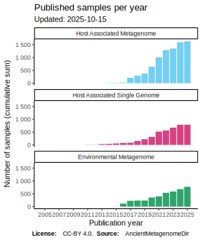
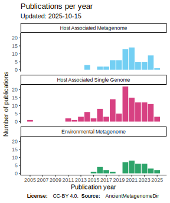

---

AncientMetagenomeDir is a community curated resource of lists of all published
**shotgun**-sequenced ancient metagenome or microbial genome-level enriched samples and libraries.

It is primarily meant to act
as a reference guide to help point researchers toward any relevant public data
for comparative analysis. It is hoped it will help researchers track growth and
development of the field of ancient metagenomics over time.

<!-- TOC -->

- [What is it about?](#what-is-it-about)
  - [Samples](#samples)
  - [Libraries](#libraries)
  - [Interactive samples map](#interactive-samples-map)
- [Who can participate?](#who-can-participate)
- [How can you use it?](#how-can-you-use-it)
  - [Citation](#citation)
- [Core Team](#core-team)

<!-- /TOC -->

## What is it about?

These lists contain information of ancient metagenomic samples such as publication, sample name, sample type,
geographic location, dates and DOIs and other accession numbers to raw data
in establised sequencing data databases.

We define here 'metagenome' in a broad sense, primarily focusing any data where the whole DNA content is analysed and
explored. Examples for this are (but not limited to) ancient microbiomes (host associated metagenome),
ancient sedimentary DNA (environmental) and also samples used for ancient pathogen
screening (single genomes).

The lists also contain metadata about all sequencing libraries generated from the corresponding samples.

See the README of each list for more detailed
descriptions of the contents of each list. Further modification and expansion of
these categories can be proposed to the [SPAAM community](https://spaam-community.github.io)
for further consideration.

The purpose of this repository is _not_ meant to be a comprehensive set of all
metadata about every ancient metagenome, but the aim is to have a lightweight
set of minimal information but with sufficient links to original sources of
detailed information. Keeping the repository simple and lightweight will promote
continual updating of the lists over a long period of time. That said, we will
design lists as far as possible to follow larger database metadata
specifications e.g.
[MIxS](https://www.ebi.ac.uk/ena/submit/mixs-checklists#MIxS_shared) for
compatibility.

Finally, we aim to make releases of this at regular intervals, and assign each
release a citeable DOI. Each release will also include a changelog to record all
additions and any corrections or modifications. Therefore researchers are free
to use the information in their own publications, as per the CC-BY 4.0 licence.

> ℹ️ A table for ancient anthropogenic metagenomes was
> included up until release v21.09 (Taputapuātea). However this was dropped in release
> "Pyu Cities" due to lack of interest from the community. It may be reinstated in
> the future.

### Samples

  
  
  
  

### Libraries

  
  

Vector (`.svg`) versions of all images and interactive map (`.geojson`) are available under [`assets/images/figures`](assets/images/figures). R code for all plots are freely available for modification in this repository under `assets/analysis/`

### Interactive samples map

[AncientMetagenomeDir](https://viewscreen.githubusercontent.com/view/geojson?url=https%3a%2f%2fraw.githubusercontent.com%2fSPAAM-community%2fAncientMetagenomeDir%2fmaster%2fassets%2fimages%2ffigures%2fancientmetagenomedir.geojson ":include :type=iframe width=100% height=400px")

(Viewable on the [AncientMetagenomeDir Website](https://spaam-community.github.io/AncientMetagenomeDir/#/) or [here](https://viewscreen.githubusercontent.com/view/geojson?url=https%3a%2f%2fraw.githubusercontent.com%2fSPAAM-community%2fAncientMetagenomeDir%2fmaster%2fassets%2fimages%2ffigures%2fancientmetagenomedir.geojson))

**Legend:**
Green: Environmental Metagenome,
Light Blue: Host Associated Metagenome,
Pink: Host Associated Single Genome

## Who can participate?

This is a community project open to anyone. If you would like to get involved, you can
join our community on [archaeo.social](https://matrix.to/#/#ancientmetagenomedir:matrix.org).
A guide to join can be found [here](https://www.isbarch.org/chat).

## How can you use it?

Guides on how to use AncientMetagenomeDir can be found [here](docs/using/).

Guides on how to contribute to AncientMetagenomeDir can be found [here](docs/contributing/).

### Citation

📖 For **general** use of the project, please use the publication citation below.

For a specific _release_ citation (e.g. the version used for analysis), go to [Releases](https://github.com/SPAAM-community/AncientMetagenomeDir/releases) and use the DOI in the badge of the given release's description, or check the corresponding [Zenodo entry](https://doi.org/10.5281/zenodo.3980833)

Alongside the Zenodo ID of the release version, please also cite:

> Fellows Yates, J. A., Andrades Valtueña, A., Vågene, Å. J., Cribdon, B., Velsko, I. M., Borry, M., Bravo-Lopez, M. J., Fernandez-Guerra, A., Green, E. J., Ramachandran, S. L., Heintzman, P. D., Spyrou, M. A., Hübner, A., Gancz, A. S., Hider, J., Allshouse, A. F., Zaro, V., & Warinner, C. (2021). Community-curated and standardised metadata of published ancient metagenomic samples with AncientMetagenomeDir. Scientific Data, 8(1), 31. DOI: [10.1038/s41597-021-00816-y](https://doi.org/10.1038/s41597-021-00816-y)

!> _WARNING_ You must also cite each paper you use data from, citing AncientMetagenomeDir is not sufficient on it's own!

> ℹ️ The AncientMetagenomeDir community curates this data on a voluntary basis, and therefore
> provides no warranty or completeness or accuracy of the data. If in doubt, refer
> to the original publication of a given sample. Corrections are accepted, and thus later
> versions may have different values.

## Core Team
The Core Team of AncientMetagenomeDir is responsible for the mantainance of the repository,
the organisation of training and hackathons events, as well as lead initiatives to improve 
AncientMetagenomeDir.
The current members of the Core Team are: 
- Alex Hübner ([@alexhbnr](https://github.com/alexhbnr))
- James Fellows Yates ([@jfy133](https://github.com/jfy133))
- Diana Spurite ([@DianaSpurite](https://github.com/DianaSpurite))
- Yuejiao Huang ([@YuejiaoHuang](https://github.com/YuejiaoHuang))
- Bianca Maria Bonucci ([@biancamariabonucci](https://github.com/biancamariabonucci))
- Piotr Rozwalak ([@rozwalak](https://github.com/rozwalak))
- Bjørn Peare Bartholdy ([@bbartholdy](https://github.com/bbartholdy))
- Aida Andrades Valtueña ([@aidaanva](https://github.com/aidaanva))

Hello
