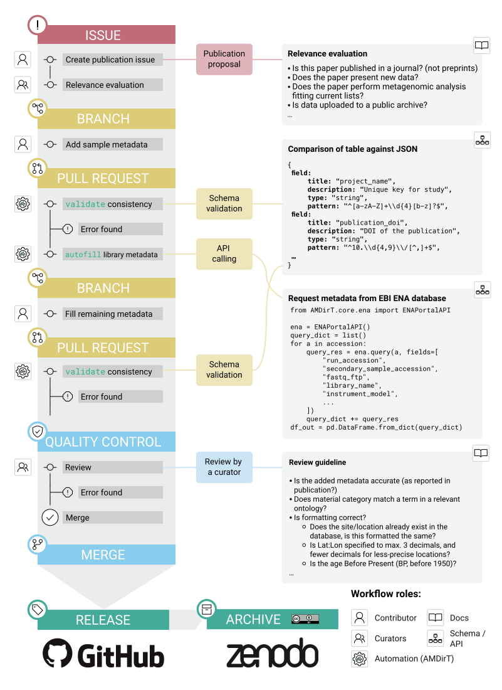

# Contributing to AncientMetagenomeDir

If you are not familiar with Git(Hub), quick start step-by-step guides can be found in
the following (**note:** these may be out of date):

- [Adding samples and libraries via pull request](docs/contributing/adding-metadata.md)
- Performing a pull request _review_ [guide](docs/contributing/reviewing-pr.md), [slides](https://hackmd.io/@jfy133/B156Z2mfP) or in [PDF format](https://github.com/spaam-community/AncientMetagenomeDir/raw/master/assets/tutorials/presentations/intro_to_ancientmetagenomedir_github_pull_request_review.pdf)

Samples must be from _published_ studies, and should only include _sample_ level
information. Preprints often have not made data avaliable at this point, and we make
the **assumption** that peer-review has correctly evaluated any submitted metagenome is
valid. Included papers should generally have uploaded their own data, however in certain
cases may see exceptions (such as retrieval of bacterial genomes from off-target reads from
human population studies). If unsure, please consult the AncientMetagenomeDir community on [slack](https://spaam-community.slack.com/channels/ancientmetagenomedir).

Samples must also have been accessible on public databases (e.g. [EBI
ENA](https://www.ebi.ac.uk/ena) or [NCBI
SRA](https://www.ncbi.nlm.nih.gov/sra)).

> Important: we do not currently record _sequencing data_ information, due to
> different uploading strategies by different groups.
