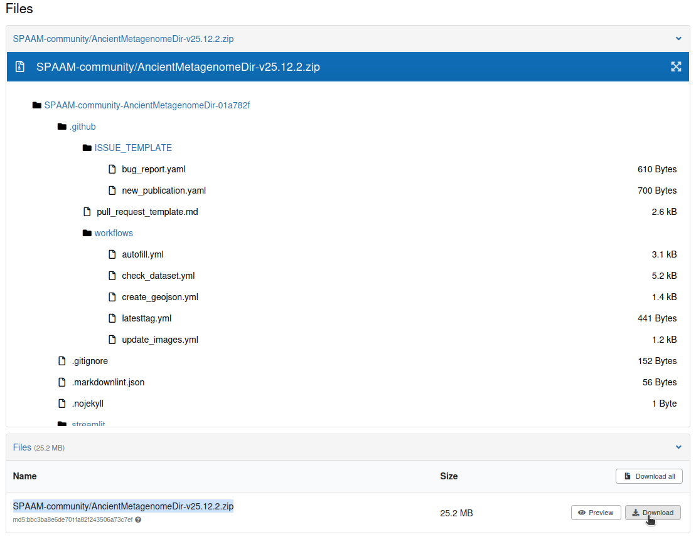
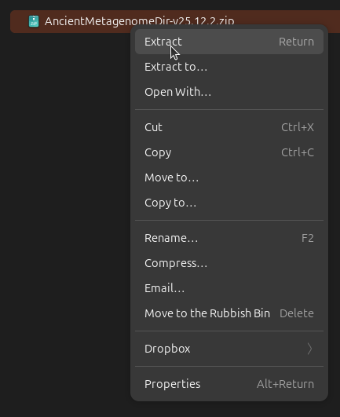
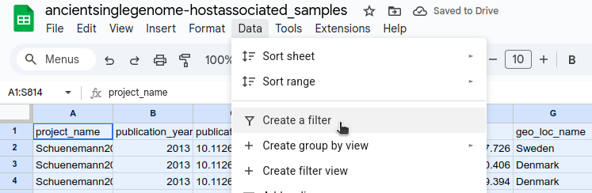
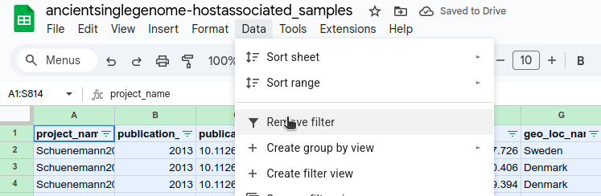
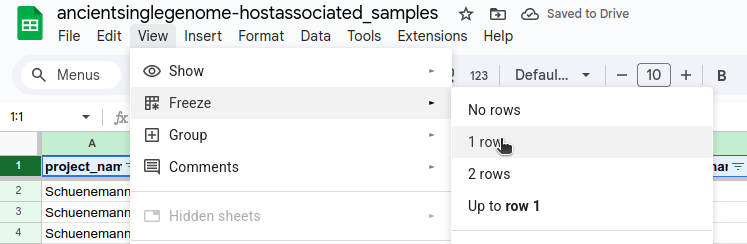
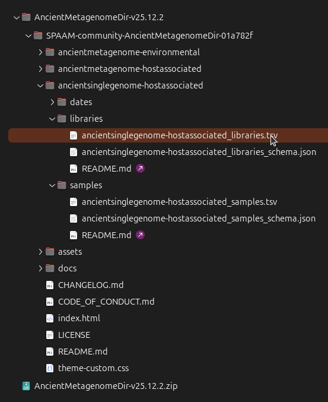
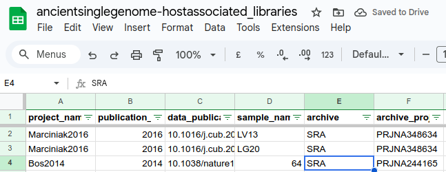

## Using AncientMetagenomeDir

### Introduction

AncientMetagenomeDir aims to improve findability and accessibility to public sequencing datasets of ancient metagenomic data - whether from ancient microbiomes, pathogen genomes, or ancient sediment DNA.

In this tutorial, we will simulate a realistic situation common for many researchers: finding public comparative data to augment analysis of novel data generated during a project.

We will need:

- An internet connection
- A Chrome-based web browser (For example: Google Chrome, Chromium, Edge)
- A spreadsheet software (For example: Microsoft Excel, Google Spreadsheets, LibreOffice Calc)

By the end of the tutorial, we will understand how to access the AncientMetagenomeDir datasets, and how to explore the datasets to find sample information and sequencing data of interest.

### Background

In this simulation, we will imagine we are research working on discovering viral pathogens in past societies.
We will assume we are a relatively new Ph.D. student, who is still getting comfortable with the commandline.
Therefore, we will prefer graphical user interfaces over command line interaction.

In this scenario, we can imagine we have discovered some individuals that have preserved historical Variola virus in medieval Norway.
To better understand the evolutionary history of the new genomes in this region, we want to place this new genomes on a phylogenomic tree.
However, as we want to understand the historical evolution of the virus in Norway, we don't want to compare to simply just modern genomes (particularly given how fast viruses can evolve).

During our literature review, we've come across multiple papers reporting ancient variola genomes.
These would be good candidates to add to our comparative data for our phylogenomic analysis - but how can we retrieve this data!
Searching on public databases on the ENA or SRA are possible, but the uploaded data in these previous publications are inconsistent making it hard to track down.

Instead, we decide to turn to AncientMetagenomeDir, which we've heard has standardised metadata of many publicly available datasets!

### Retrieving Data

In the name of reproducibility and openness, we want to make sure we use a stable and citable release of the AncientMetagenomeDir datasets.
We can then include this table in our eventual publication's Supplementary Information.

To do this, we first go to the [SPAAM website](https://www.spaam-community.org/AncientMetagenomeDir) or [GitHub repository](https://github.com/SPAAM-community/AncientMetagenomeDir) (both are fine).

We then look for the Zenodo badge, which should look like this:

> ℹ️ Note: this DOI this version is for v25.12.2: Historic Centre of Sighișoara
> Always check for the latest version (or your preferred version), using the 'Versions' section of the sidebar on the Zenodo page

On this page, we can scroll down to the 'Files' section.

To save the dataset, we press the 'Download' button to the right of the `SPAAM-community/AncientMetagenomeDir-v25.12.2.zip` file, to download to our computer.

Once downloaded, extract the Zip archive file using your file explorer's extract utility.

.

Once extracted, enter into the folder of interest in the resulting directory.

In this case, we want to look at the `ancientsinglegenome-hostassociated` table, that corresponds to microbial genomes associated with organisms (humans, animals, and so on).
This table contains single genomes of different microbes, including Viruses.

.

### Exploring Data

#### Samples

Now we have found the tables of interest for our particular Virus study - we can open the `.tsv` (or table separated value) file in our preferred spreadsheet software.
In this case, we will open it in Google Docs.

.

Once open, to make it easier to search and explore the table, we turn on 'Data Filtering' (indicated as activated by the green triangle symbols next to each column), and freeze the first row.

> ℹ️ All spreadsheet managers will have similar systems, so explore the menus to find the relevant functionality.

.
.
.

Now our Google Sheets window is set up, we can now explore the data!

We are looking for Variola Virus genomes to compare against, so lets first filter to just that taxon.

For this, we scroll to the `singlegenome_species` column, open the filter, clear all selections, and search and select for only `Variola virus`.

.

We can then do the same filtering procedure on the `geo_loc_name` column to find just the genomes from Norway, matching our own data.

.

This results in two previously published samples from Norway that had preserved ancient Variola virus ancient DNA.

We can check the `sample_age` column to see the see that both also fit approximately in our time period of the Medieval ages.

.

We can also see in the last column, titled `archive_accession`, a list of sample-level accession codes, corresponding to the sample codes in public sequencing data archives.

#### Libraries and Data

These accession codes are important for the second part of our exploration: how to get the sequencing data itself!

For this, we need to return to our downloaded Zenodo archive, but instead of opening the sample table, we open the library table into our Spreadsheet software.

.

Once opened, we can set the same filter and freezed row set up as with the samples table.

.

Using the two sample archive accessions we discovered above, we can filter the library table's `archive_sample_accession` column to the two samples we found in the previous table.

.

This table has lots of information about the specific DNA library that was sequenced, such as the strandedness of the library, library treatment (was damage removed), and what platform the library was sequenced on.

In this case, as we want to place genomes on a phylogenomic tree, we will assume that the 'targed capture' libraries will have sufficient enriched genomic coverage for such purpose.
Therefore we filter the column `library_strategy` to 'Targeted-Capture'.

.

Now we have identified the relevant samples and compatible libraries for our dataset, we can download our data!

.

We can scroll to the `download_links` column, and there we will find FTP URLs we can use to download the sequencing data's FASTQ files from the ENA.
For this you can either click the URL to download to your machine, or copy the link to use command line tools such as `wget` or `curl` to download to your server or cluster.

You can also use the associated `download_size` and `download_md5s` columns to give you an estimate of required harddrive space, and validate the integrity of the downloaded file.

### Conclusion

In this tutorial we have learnt how to access an AncientMetagenomeDir dataset, open a samples and libraries table in a spreadsheet software and explore it to find samples and data of interest.

With this, you can build more complex filtering and search patterns.
Using AncientMetagenomeDir will make data retrieval much more efficient and help you to build larger and better datasets for more robust scientific rediscovery of our collective past.
